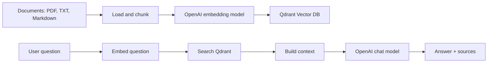

# Simple AI Chatbot with RAG and Qdrant Vector DB

This repository contains a Python MVP for a Retrieval-Augmented Generation
(RAG) chatbot. It loads local documents, creates embeddings with OpenAI, stores
vectors in Qdrant, retrieves relevant chunks for each question, and asks an LLM
to answer using only the retrieved context.

## Features

- FastAPI backend
- `GET /health` endpoint
- `POST /chat` endpoint
- Document ingestion CLI
- Qdrant vector database with Docker Compose
- OpenAI embeddings and chat completion
- PDF, Markdown, and text document loading
- Chunking with overlap
- Source references in chat responses
- Makefile commands for setup, ingestion, running, and testing

## Architecture



## Project Structure

```text
ai-chatbot/
  rag_chatbot/
    api.py            # FastAPI app
    chatbot.py        # RAG orchestration
    config.py         # Environment-based settings
    documents.py      # PDF/text/markdown loading and chunking
    embeddings.py     # OpenAI embedding client
    ingest.py         # Document ingestion CLI
    llm.py            # OpenAI chat client
    qdrant_store.py   # Qdrant REST client
  data/
    docs/             # Put your documents here
  docker-compose.yml
  Makefile
  requirements.txt
  .env.example
  README.md
```

## Prerequisites

Install these tools:

- Python 3.11, 3.12, or 3.13
- Docker and Docker Compose
- `make`
- An OpenAI API key

## Setup

### 1. Install Python Dependencies

```bash
make install
```

The Makefile creates `.venv` and installs dependencies from
`requirements.txt`. It tries `python3.13`, `python3.12`, and `python3.11`
before falling back to `python3`.

You can choose a specific Python version:

```bash
make install PYTHON=python3.12
```

### 2. Create `.env`

```bash
cp .env.example .env
```

Edit `.env` and set your OpenAI API key:

```bash
OPENAI_API_KEY=your_real_openai_api_key
```

Default configuration:

```bash
OPENAI_CHAT_MODEL=gpt-4.1-mini
OPENAI_EMBEDDING_MODEL=text-embedding-3-small

QDRANT_URL=http://localhost:6333
QDRANT_COLLECTION=ai_chatbot_docs
QDRANT_VECTOR_SIZE=1536

APP_PORT=8080
CHUNK_SIZE=800
CHUNK_OVERLAP=120
TOP_K=5
MIN_SCORE=0.25
MAX_CONTEXT_CHARS=12000
LLM_TEMPERATURE=0.2
```

Do not commit `.env`.

### 3. Start Qdrant

```bash
make qdrant-up
```

Check Qdrant:

```bash
curl http://localhost:6333/healthz
```

Qdrant dashboard:

```text
http://localhost:6333/dashboard
```

### 4. Add Documents

Put documents in:

```text
data/docs/
```

Supported file types:

- `.pdf`
- `.txt`
- `.md`
- `.markdown`

### 5. Ingest Documents

```bash
make ingest
```

The ingestion command:

1. Reads supported files from `data/docs`.
2. Extracts text from PDF, Markdown, and text files.
3. Splits text into overlapping chunks.
4. Creates embeddings for each chunk.
5. Creates the Qdrant collection if it does not exist.
6. Upserts vectors and metadata into Qdrant.

Example output:

```text
Upserted 32/120 chunks
Upserted 64/120 chunks
Ingestion completed
Documents: 2
Chunks: 120
Collection: ai_chatbot_docs
```

### 6. Run the API

```bash
make run
```

The API runs at:

```text
http://localhost:8080
```

For development with auto-reload:

```bash
make dev
```

## Test the API

Run these commands in another terminal while the API is running.

### Health Check

```bash
make health
```

Expected response:

```json
{"status":"ok"}
```

### Chat Request

```bash
make chat
```

Or send a custom question:

```bash
curl -X POST http://localhost:8080/chat \
  -H "Content-Type: application/json" \
  -d '{
    "message": "What is this document about?"
  }'
```

Example response:

```json
{
  "answer": "The document is about ...",
  "sources": [
    {
      "id": "chunk-id",
      "source": "data/docs/example.pdf",
      "title": "Example",
      "section": "chunk-0001",
      "score": 0.82
    }
  ]
}
```

### Swagger UI

Open:

```text
http://localhost:8080/docs
```

Use `POST /chat`, click `Try it out`, enter a JSON body, and execute the
request.

## API Reference

### `GET /health`

Response:

```json
{
  "status": "ok"
}
```

### `POST /chat`

Request:

```json
{
  "message": "Your question"
}
```

Response:

```json
{
  "answer": "Answer generated from retrieved context.",
  "sources": [
    {
      "id": "chunk-id",
      "source": "data/docs/example.pdf",
      "title": "Example",
      "section": "chunk-0001",
      "score": 0.82
    }
  ]
}
```

## Makefile Commands

| Command | Description |
| --- | --- |
| `make help` | Show available commands |
| `make install` | Create `.venv` and install dependencies |
| `make qdrant-up` | Start Qdrant with Docker Compose |
| `make qdrant-down` | Stop Qdrant |
| `make qdrant-logs` | Follow Qdrant logs |
| `make ingest` | Ingest documents from `data/docs` |
| `make run` | Run the FastAPI server |
| `make dev` | Run the FastAPI server with auto-reload |
| `make health` | Call `GET /health` |
| `make chat` | Send a sample request to `POST /chat` |
| `make clean` | Remove Python cache files |

## Full Run Sequence

```bash
make install
cp .env.example .env
# Edit .env and set OPENAI_API_KEY
make qdrant-up
make ingest
make run
```

In another terminal:

```bash
make health
make chat
```

## Stop Services

Stop the API with `Ctrl+C`.

Stop Qdrant:

```bash
make qdrant-down
```
