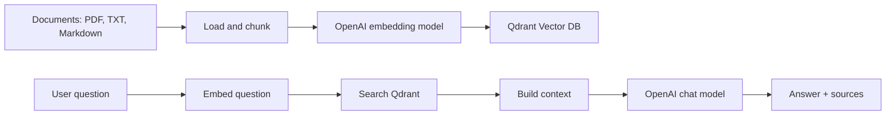

# Simple AI Chatbot with RAG and Qdrant Vector DB

This repository contains a small Python MVP for a Retrieval-Augmented
Generation (RAG) chatbot. It loads local documents, creates embeddings with
OpenAI, stores vectors in Qdrant, retrieves relevant chunks for each question,
and asks an LLM to answer using only the retrieved context.

## What This MVP Includes

- Python FastAPI backend
- `POST /chat` endpoint
- `GET /health` endpoint
- Document ingestion CLI
- Qdrant vector database with Docker Compose
- OpenAI embeddings and chat completion integration
- PDF, Markdown, and text document loading
- Chunking with overlap
- Source references in chat responses
- Makefile commands for setup, ingestion, and running the API

## Architecture



## Project Structure

```text
ai-chatbot/
  rag_chatbot/
    api.py            # FastAPI app
    chatbot.py        # RAG orchestration
    config.py         # Environment-based settings
    documents.py      # PDF/text/markdown loading and chunking
    embeddings.py     # OpenAI embedding client
    ingest.py         # Document ingestion CLI
    llm.py            # OpenAI chat client
    qdrant_store.py   # Qdrant REST client
  data/
    docs/
      AIO_Exercise_Book_v2025.pdf
  docker-compose.yml
  Makefile
  requirements.txt
  .env.example
  README.md
```

## Prerequisites

Install these tools first:

- Python 3.11 or newer
- Docker and Docker Compose
- `make`
- An OpenAI API key

## Step-by-Step Setup

### 1. Create the Python Environment

```bash
make install
```

This command creates `.venv` and installs all Python dependencies from
`requirements.txt`.

### 2. Create Your Environment File

```bash
cp .env.example .env
```

Open `.env` and set your real OpenAI API key:

```bash
OPENAI_API_KEY=your_real_openai_api_key
```

Default settings:

```bash
OPENAI_CHAT_MODEL=gpt-4.1-mini
OPENAI_EMBEDDING_MODEL=text-embedding-3-small

QDRANT_URL=http://localhost:6333
QDRANT_COLLECTION=ai_chatbot_docs
QDRANT_VECTOR_SIZE=1536

APP_PORT=8080
CHUNK_SIZE=800
CHUNK_OVERLAP=120
TOP_K=5
MIN_SCORE=0.25
MAX_CONTEXT_CHARS=12000
LLM_TEMPERATURE=0.2
```

Important: do not commit `.env`. It is already ignored by `.gitignore`.

### 3. Start Qdrant

```bash
make qdrant-up
```

Check Qdrant:

```bash
curl http://localhost:6333/healthz
```

Open the dashboard:

```text
http://localhost:6333/dashboard
```

### 4. Add Documents

Put your documents in:

```text
data/docs/
```

Supported file types:

- `.pdf`
- `.txt`
- `.md`
- `.markdown`

This repository already contains:

```text
data/docs/AIO_Exercise_Book_v2025.pdf
```

### 5. Ingest Documents into Qdrant

```bash
make ingest
```

The ingestion command does the following:

1. Reads all supported files from `data/docs`.
2. Extracts text from PDF/text/Markdown files.
3. Splits text into overlapping chunks.
4. Creates embeddings for each chunk.
5. Creates the Qdrant collection if needed.
6. Upserts chunk vectors and metadata into Qdrant.

Expected output looks like:

```text
Upserted 32/120 chunks
Upserted 64/120 chunks
...
Ingestion completed
Documents: 1
Chunks: 120
Collection: ai_chatbot_docs
```

If ingestion fails with an OpenAI error, check that `OPENAI_API_KEY` is set
correctly in `.env`.

### 6. Run the API

```bash
make run
```

The API starts on:

```text
http://localhost:8080
```

For development with auto-reload:

```bash
make dev
```

### 7. Test the Health Endpoint

In another terminal:

```bash
make health
```

Expected response:

```json
{"status":"ok"}
```

### 8. Ask a Question

```bash
make chat
```

Or send your own question:

```bash
curl -X POST http://localhost:8080/chat \
  -H "Content-Type: application/json" \
  -d '{
    "message": "What is this document about?"
  }'
```

Example response:

```json
{
  "answer": "The document appears to be about ...",
  "sources": [
    {
      "id": "7f8d...",
      "source": "data/docs/AIO_Exercise_Book_v2025.pdf",
      "title": "AIO Exercise Book v2025",
      "section": "chunk-0003",
      "score": 0.78
    }
  ]
}
```

## Makefile Commands

| Command | Description |
| --- | --- |
| `make help` | Show available commands |
| `make install` | Create `.venv` and install dependencies |
| `make qdrant-up` | Start Qdrant with Docker Compose |
| `make qdrant-down` | Stop Qdrant |
| `make qdrant-logs` | Follow Qdrant logs |
| `make ingest` | Ingest documents from `data/docs` |
| `make run` | Run the FastAPI server |
| `make dev` | Run the FastAPI server with auto-reload |
| `make health` | Call `GET /health` |
| `make chat` | Send a sample request to `POST /chat` |
| `make clean` | Remove Python cache files |

## API Reference

### Health

```http
GET /health
```

Response:

```json
{
  "status": "ok"
}
```

### Chat

```http
POST /chat
Content-Type: application/json

{
  "message": "Your question"
}
```

Response:

```json
{
  "answer": "Answer generated from retrieved context.",
  "sources": [
    {
      "id": "chunk-id",
      "source": "data/docs/example.pdf",
      "title": "Example",
      "section": "chunk-0001",
      "score": 0.82
    }
  ]
}
```

## How the Code Works

### Document Loading

`rag_chatbot/documents.py` reads files from `data/docs`.

- PDFs are parsed with `pypdf`.
- Markdown and text files are read as UTF-8.
- Empty files are skipped.

### Chunking

Documents are split by words.

Default settings:

- `CHUNK_SIZE=800`
- `CHUNK_OVERLAP=120`

Each chunk receives:

- stable chunk ID
- text
- source path
- title
- section name
- chunk index

### Embedding

`rag_chatbot/embeddings.py` calls the OpenAI embeddings API.

Default model:

```text
text-embedding-3-small
```

The default vector size is `1536`, which must match
`QDRANT_VECTOR_SIZE`.

### Qdrant Storage

`rag_chatbot/qdrant_store.py` talks to Qdrant through REST APIs.

It can:

- create the collection
- upsert chunk vectors
- search top-k similar chunks

### RAG Chat

`rag_chatbot/chatbot.py` performs the runtime flow:

1. Embed the user question.
2. Search Qdrant for similar chunks.
3. Filter results by `MIN_SCORE`.
4. Build a context block.
5. Ask the chat model to answer from context.
6. Return the answer and sources.

The system prompt tells the model to answer only from the provided context.

## Configuration

| Variable | Default | Description |
| --- | --- | --- |
| `OPENAI_API_KEY` | empty | Required OpenAI API key |
| `OPENAI_CHAT_MODEL` | `gpt-4.1-mini` | Chat model |
| `OPENAI_EMBEDDING_MODEL` | `text-embedding-3-small` | Embedding model |
| `QDRANT_URL` | `http://localhost:6333` | Qdrant URL |
| `QDRANT_COLLECTION` | `ai_chatbot_docs` | Qdrant collection name |
| `QDRANT_VECTOR_SIZE` | `1536` | Embedding vector dimension |
| `APP_PORT` | `8080` | API port |
| `CHUNK_SIZE` | `800` | Words per chunk |
| `CHUNK_OVERLAP` | `120` | Overlapping words between chunks |
| `TOP_K` | `5` | Number of chunks retrieved |
| `MIN_SCORE` | `0.25` | Minimum similarity score |
| `MAX_CONTEXT_CHARS` | `12000` | Max context sent to the LLM |
| `LLM_TEMPERATURE` | `0.2` | Chat model temperature |

## Troubleshooting

### `OPENAI_API_KEY is required`

Create `.env` and set:

```bash
OPENAI_API_KEY=your_real_openai_api_key
```

### Qdrant Connection Error

Start Qdrant:

```bash
make qdrant-up
```

Then check:

```bash
curl http://localhost:6333/healthz
```

### Vector Dimension Error

The Qdrant collection vector size must match the embedding model.

For `text-embedding-3-small`, use:

```bash
QDRANT_VECTOR_SIZE=1536
```

If you change the embedding model, recreate the Qdrant collection or use a new
`QDRANT_COLLECTION` name, then run:

```bash
make ingest
```

### No Relevant Information Found

Try:

- Running `make ingest` again.
- Lowering `MIN_SCORE`.
- Increasing `TOP_K`.
- Adding more documents to `data/docs`.
- Improving document formatting before ingestion.

## Full Run Sequence

For a fresh machine, run:

```bash
make install
cp .env.example .env
# Edit .env and set OPENAI_API_KEY
make qdrant-up
make ingest
make run
```

Then test in another terminal:

```bash
make health
make chat
```

## Stop Services

Stop the API with `Ctrl+C`.

Stop Qdrant:

```bash
make qdrant-down
```
